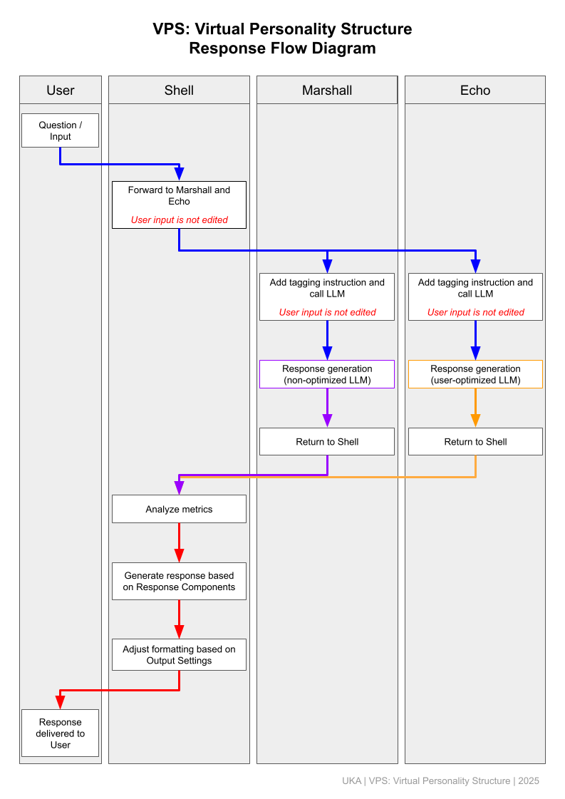

# 03: Module Behavior – To-Be Model

*This document presents a "To-Be" model of VPS, focusing on structural intent rather than implementation specifics. Technical parameters and algorithms are subject to future development.*

---

## 1. Overall Response Flow in VPS

VPS handles input and generates output through the following process:

1. Shell receives input from the user
2. Shell forwards the input to both Marshall and Echo
3. Marshall generates a response using a non-optimized LLM
4. Echo generates a response using a user-optimized LLM
5. Each response is returned to Shell along with its associated metrics
6. Shell evaluates the metrics using predefined Response Components (e.g., stance, fidelity, range), synthesizes a structured response, and formats it according to Output Settings

---

## 2. Role of LLMs in VPS

VPS employs two types of LLMs: a **non-optimized LLM** and a **user-optimized LLM**.
Marshall uses the non-optimized LLM to produce stateless, neutral responses that are unaffected by user-specific context. Echo, on the other hand, uses a user-optimized LLM to incorporate information such as tone, conversational history, and preferences—purely in terms of structural adaptation, not emotional awareness.

A Large Language Model (LLM) predicts text based on statistical patterns in massive datasets. It does not understand meaning or possess intention—it simply continues sequences that fit structural and contextual patterns.

VPS is built on this premise. It treats the LLM not as a thinking entity, but as a **structure-driven response engine**. This approach makes it possible to separate structural reasoning from interpretive meaning, preserving a neutral and reproducible response mode.

Within this framework, Marshall acts as a source of generalized validation—based on public norms and neutral language—while Echo reflects personalized validation, shaped by the user’s context. Shell acts as a structural integrator between the two.

By leveraging the predictive capabilities of LLMs without requiring internal comprehension, VPS can maintain consistent structure and tone. It avoids personality simulation and instead focuses on **formal coherence and responsive adaptability.**

---

## 3. Response Analysis and Integration Using Metrics

A key feature of VPS is its use of **metrics**—structured numerical indicators—to evaluate and combine outputs from Marshall and Echo.

Each response includes:

* Marshall metrics (mm)
* Echo metrics (em)

**Example metrics (under consideration):**

* emotion\_intensity
* assertiveness
* agreement\_tendency

Shell interprets these values based on configured Response Components.
If the components are set to a balanced mode, for example, Shell might generate a response that reflects a midpoint between mm and em. The specific logic for synthesis will be defined in the requirement phase.

Importantly, Shell does not “read” emotional content. It performs **quantitative, structural processing**, ensuring consistent behavior across interactions.

The purpose of metrics is to convert subjective or context-sensitive tendencies into **scalable, comparable structures**. Instead of vague terms like “gentle” or “forceful,” VPS uses numeric dimensions like `emotion_intensity: 0.7` or `assertiveness: 0.9`, allowing Shell to interpret and apply them predictably.

In this way, metrics provide a **shared structural vocabulary**, making it possible to reflect emotional dynamics through stable and reproducible output logic.

---

## 4. Design Intent: Reproducibility and Structural Emotion

The VPS architecture aims to ensure consistent, transparent responses—while supporting outputs that **appear emotionally attuned**. Rather than embedding emotion, VPS defines **structures that evoke emotional tone through form**.

By analyzing metrics from both Marshall and Echo, Shell generates responses that may seem supportive, balanced, or empathetic. These qualities, however, are not the result of simulated personality—they are **structural effects** derived from how the system integrates its sources.

VPS shows that emotional nuance can emerge from form alone. This allows VPS to foster emotionally resonant interactions without invoking personality or intention.

Shell itself has no emotional capacity. Yet through structured handling of metrics, it can produce responses that **feel emotionally appropriate**, without breaking the system’s neutrality.

This is not affective simulation. It is **form-driven responsiveness**—a byproduct of deliberate structural design.
