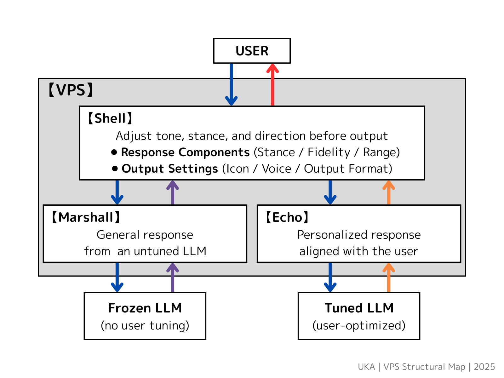

# VPS: Virtual Personality Structure

## 🧩 Abstract

**VPS (Virtual Personality Structure)** is a design framework for structurally adjusting LLM responses  
without assigning personality, intention, or emotion.

It compares **non-optimized outputs (Marshall)** and **user-optimized outputs (Echo)** generated by an LLM,  
and uses a neutral structure called **Shell** to select and format the final response.

By shaping AI behavior through structure rather than emotional performance or excessive alignment,  
VPS aims to support interactions that remain **non-dependent, transparent, and adaptable**.

     

---

## 📘 Document Index

### 00: Overview
- [01: Concept Overview](01_Concept_Overview.md)   
  Introduction to the background, purpose, and foundational philosophy of VPS.
  
- [02: Core Structure](02_Core_Structure.md)    
  Overview of the VPS architecture and its three core components: Marshall, Echo, and Shell.

### 10: Modules
- `11: Marshall`  
  Neutral Reference Layer — a source of non-optimized LLM outputs providing structural neutrality.
- `12: Echo`  
  User-Aligned Reflection — contextually attuned responses reflecting user tone and preference.
- `13: Shell`  
  Structural Decision Layer — a non-personal decision engine that selects and formats responses using behavioral parameters.

### 90: Resources
- `91: Glossary of VPS Terms`  
  Terminology reference and reframed definitions used within the VPS framework.

---

## 🧭 About this Repository

This repository documents the conceptual and structural foundations of VPS (Virtual Personality Structure),  
a non-anthropomorphic design approach to AI dialogue behavior.

The project is currently under active development.  
All documents are subject to revision and expansion as the structure evolves.

---

## © License & Contact

All content in this repository is © 2025 UKA.  
Unauthorized reproduction, redistribution, or adaptation is not permitted.  
If you would like to reference, quote, or collaborate on this framework, please reach out in advance.

For inquiries or feedback, feel free to contact me via X (formerly Twitter): 
[@shell_by_u](https://x.com/shell_by_u)

---

## 🛠 Status (as of 2025-05-24)

- [x] Concept Overview (Draft)
- [x] Core Structure (Draft)
- [ ] Shell
- [ ] Marshall
- [ ] Echo
- [ ] Glossary
